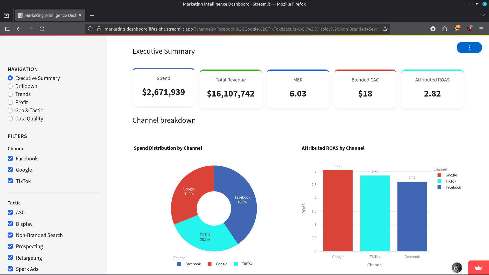
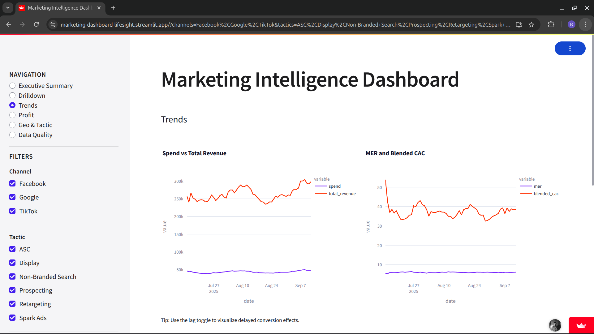
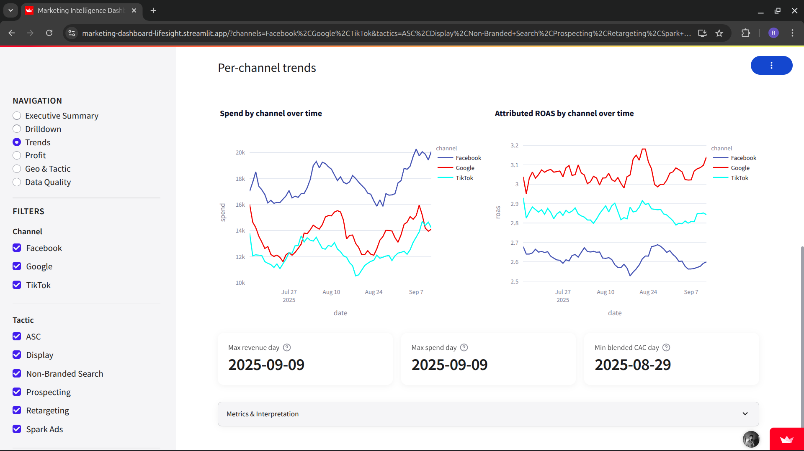
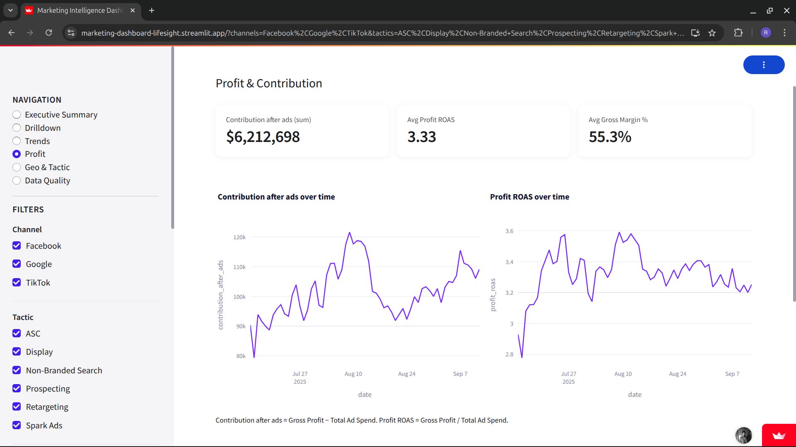

# Marketing Intelligence Dashboard

A data-driven, interactive Streamlit dashboard that connects paid marketing activity (Facebook, Google, TikTok) to business outcomes (orders, revenue, profit).

Live app: https://marketing-dashboard-lifesight.streamlit.app/

## Overview

This dashboard helps marketing and business leaders understand the relationship between marketing spend and business results across multiple dimensions:

- Executive metrics (MER, ROAS, CAC, contribution margin)
- Channel performance comparison
- Trend analysis with lag effects
- Geographic and tactical insights
- Profit contribution analysis
- Data quality assessment

## Features

### 1. Executive Summary
- KPIs with previous period comparisons: Spend, Total revenue, MER, Blended CAC, Attributed ROAS
- Channel breakdown with spend, revenue, ROAS, impressions, and clicks
- Target metric comparison (when targets are provided)

### 2. Trends & Efficiency
- Time series: Spend vs Total revenue (dual axis)
- Time series: MER and Blended CAC
- Per-channel trend visualization
- Lag toggle (0–3 day shift) to visualize delayed conversion effects
- 7-day rolling average option for smoother trends
- Key date insights (max revenue, max spend, min CAC)

### 3. Channel & Campaign Drilldown
- Channel performance bar charts: Spend, ROAS, CTR, CPC, CPM
- Campaign-level table with sortable metrics
- Flexible filtering by channel, tactic, state

### 4. Geo & Tactic Analysis
- State-level performance visualization
- Tactic comparison across channels
- Interactive map visualization

### 5. Profit & Contribution
- Contribution after ads trend
- Profit ROAS visualization
- Top/bottom days by contribution
- Gross margin percentage tracking

### 6. Data Quality
- Coverage analysis across data sources
- Missing value identification
- Data reconciliation between platform and business metrics

## Technical Implementation

### Data Sources
- **Marketing data**: `Facebook.csv`, `Google.csv`, `TikTok.csv` (campaign-level daily metrics)
- **Business data**: `business.csv` (daily business performance metrics)

### Key Derived Metrics
- MER (Blended ROAS) = Total Revenue / Total Ad Spend
- Blended CAC = Total Ad Spend / New Customers
- CTR = Clicks / Impressions
- CPC = Spend / Clicks
- CPM = 1000 * Spend / Impressions
- Attributed ROAS = Attributed Revenue / Spend
- Gross Margin % = Gross Profit / Total Revenue
- Contribution After Ads = Gross Profit - Total Spend
- Profit ROAS = Gross Profit / Total Spend

### Interactions & Controls
- Global filters: date range, channel, tactic, state
- Quick date range presets (Last 7/30/90 days, MTD, QTD, YTD)
- Toggles: 7-day rolling average, lag shift (0–3 days)
- Optional KPI target inputs for performance comparison
- Shareable filter URLs for collaboration

## Local Setup

1) Create a virtual environment (Python 3.10+) and activate it
2) Install requirements
3) Run the Streamlit app

Linux/macOS example:

```bash
python -m venv .venv
source .venv/bin/activate
pip install -r requirements.txt
streamlit run app/main.py
```

Data files are expected at `data/` relative to the repo root. You can also point to a custom folder by setting an environment variable before running:

```bash
export DATA_DIR=/absolute/path/to/your/data
streamlit run app/main.py
```

## Project Structure

- `app/` – Streamlit app
  - `main.py` – entry point, routing, and filters
  - `data.py` – data loading, cleaning, and normalization
  - `metrics.py` – derived metric calculations
  - `theme.py` – UI styling and theme settings
  - `views/` – dashboard pages
    - `summary.py` – Executive Summary with KPIs and channel breakdown
    - `trends.py` – Time series analysis with lag options
    - `drilldown.py` – Channel and campaign-level analysis
    - `geo_tactic.py` – Geographic and tactical performance
    - `profit.py` – Profit and contribution margin analysis
    - `data_quality.py` – Data quality assessment and reconciliation
- `data/` – CSV inputs (Facebook, Google, TikTok, business)
- `docs/` – Documentation and plan
  - `plan.md` – Detailed implementation plan
  - `screenshots/` – Dashboard visualizations
- `requirements.txt` – Pinned dependencies

## Deployment

The dashboard is deployed on Streamlit Community Cloud:

1) Create a Streamlit Cloud account
2) Connect to this GitHub repository
3) Configure the app to use `app/main.py` as the entry point
4) Set Python 3.10+ as the runtime environment

## Screenshots


*Executive Summary: KPIs and channel breakdown*


*Trends: Spend vs Revenue time series*


*Trends: MER & Blended CAC metrics over time*


*Profit: Contribution and Profit ROAS metrics*

## Methodology & Assumptions

- Business data is the source of truth for total revenue and profit metrics
- Platform "attributed revenue" is used only for channel/campaign ROAS calculations
- All calculations guard against division by zero
- Missing values are filled with zeros for numeric aggregations
- Lag analysis helps account for delayed conversion effects
- 7-day rolling averages smooth daily volatility for better trend visibility

## Next Steps & Future Enhancements

- Budget pacing and forecasting module
- A/B test analysis integration
- Cohort retention analysis
- Integration with API data sources for automatic updates
- Enhanced cross-channel attribution modeling